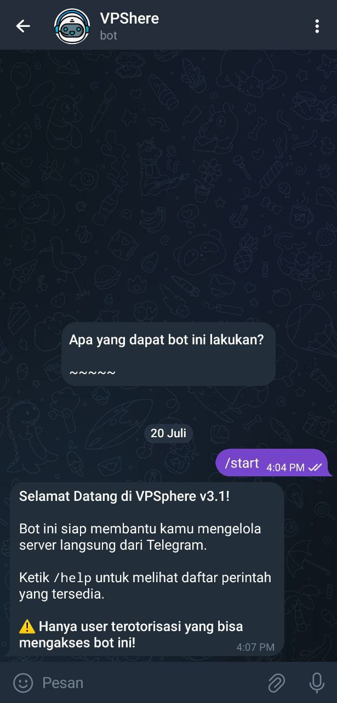
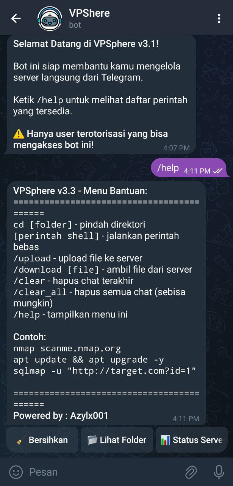
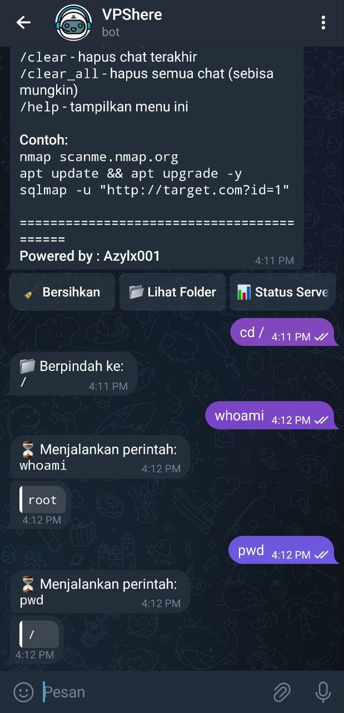

# VPSphere v3.3 - Telegram Server Manager Bot

[](https://github.com/Azyyyl/VPSphere)
[](LICENSE)
[](https://www.python.org/)
[](https://github.com/Azyyyl/VPSphere/issues)
[](https://github.com/Azyyyl/VPSphere/stargazers)

VPSphere is a **Telegram Bot** designed to manage your VPS server directly from Telegram.  
Easily execute commands, monitor server health, and receive real-time notifications.

---

## Features
- Execute shell commands (`ls`, `nmap`, `sqlmap`, etc.).
- Upload & download files (up to 2GB).
- Real-time **SSH login notifications**.
- Monitor server uptime, memory, and disk usage.

---

## Screenshots
Here’s how VPSphere looks in action:

  
  
  

---

## Installation

### 1. Clone the Repository
```bash
git clone https://github.com/Azyyyl/VPSphere.git
cd VPSphere
```

### 2. Set Up Virtual Environment & Install Dependencies
```bash
python3 -m venv venv
source venv/bin/activate
pip install --upgrade pip
pip install -r requirements.txt
```

### 3. Configure `.env` File
Edit the `.env` file in the project directory:
```env
BOT_TOKEN=your_telegram_bot_token
USER_ID=your_telegram_user_id
```

### 4. Run the Bot Manually (Optional)
```bash
python3 VPSphere.py
```

---

## Run as a Service (Recommended)

### 1. Create a systemd Service File
```bash
sudo nano /etc/systemd/system/VPSphere.service
```
Add the following:
```ini
[Unit]
Description=VPSphere Telegram Bot
After=network.target

[Service]
Type=simple
User=ubuntu
WorkingDirectory=/opt/VPSphere
ExecStart=/opt/VPSphere/venv/bin/python3 /opt/VPSphere/VPSphere.py
Restart=always
RestartSec=5
Environment="PYTHONUNBUFFERED=1"

[Install]
WantedBy=multi-user.target
```

Replace `User=ubuntu` and paths as needed.

### 2. Enable & Start the Service
```bash
sudo systemctl daemon-reload
sudo systemctl enable VPSphere
sudo systemctl start VPSphere
sudo systemctl status VPSphere
```

### 3. View Bot Logs
```bash
journalctl -u VPSphere -f
```

---

## Project Structure
```
VPSphere/
├── assets/
│   └── screenshots/
│       ├── Commands.jpg
│       ├── Help.jpg
│       └── Start.jpg
├── cek_id.py
├── LICENSE
├── README.MD
├── requirements.txt
├── VPSphere.py
└── .env (to be created manually)
```

---

## License
This project is licensed under the **MIT License**.  
Developed by **Azylx001**. Use responsibly for server management.
